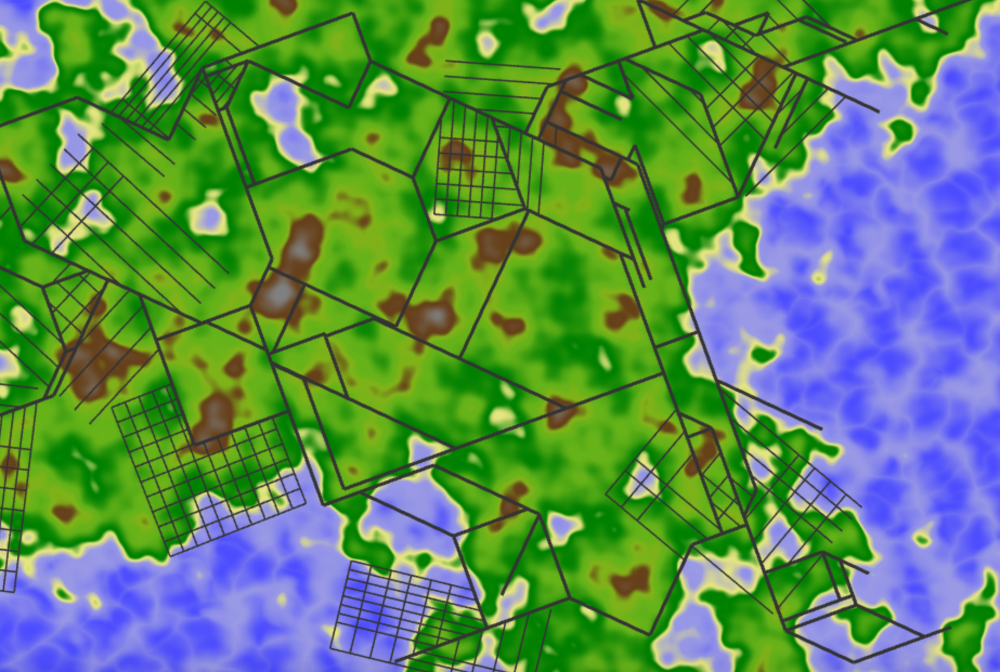

# Homework 5: Road Generation
## Steven Galban, PennKey: sgalban

## Overview
In this assignment, I accomplished 3 primary tasks:
- I used noise functions to generate terrain and a population density
- I used L-System-esque techniques to generate a highway system that generally follows population density
- I used some graph theory and basic geometry to create small, gridlike neighborhoods that are located in areas of high population, and intersect properly with the highways

## Terrain/Population Generation
- My terrain generation is fairly standard. I used perlin noise to generate some hills and mountains, and then subtracted away some fractal brownian motion, which levels out the land a bit, and creates areas with a negative height (which become the oceans and lakes). 
- The population density was created using perlin noise. In order to ensure that the density wasn't too uniform, as perlin noise tends to be pretty low contract compared to other noise functions, I cubed the resulting value, creating prominent blobs of high population. I also created a falloff function based on the terrain height, which ensures that there is no population on the tops of mountains or in bodies of water. The population density can be visualized (in red) using the "Show Population" control.
- In order to make the scene more visually interesting, I used a variety of noise functions to give the terrain some proper coloring. Most of these techniques were also used in the procedural terrain assignment earlier this semester, including the FBM-perturbed worley noise water effect, but I also used the heightmap to ensure that the water near the coastline is more saturated.
- This generation was performed separately on the CPU and the GPU, and making sure the output was identical was the tricknest part. Even when the random functions only use floating points, the values were never quite the same, likely due to the different ways the processors deal with floating-point-imprecision. After modifying the noise functions (which make them less "random", though it's not noticable on the scale of this project), I reached a result that was not perfect, but good enough for my needs. For this reason, you may notice some roads that begin to branch into the water, but fortunately, the CPU avoids wandering very far into the ocean, and the road generation looks reasonable.

## Highway Generation
The highway uses an L-System-like turtle to grow forward and branch.
- The roads are drawn using an instanced rectangle. For each segment, the 2 endpoints are passed to the GPU (as this meshes conveniently with the graph structure I use), where the segment is then transformed and converted to screen space appropriately. The same techniques are used when rendering the grid roads.
- As described in the provided paper, after generating a segment of road, the generator tests 5 points in a radial fan in front of the current endpoint. These points are an equal distance from the current road end, and are equiangluar (I tried providing some random variation to the angles, but I found that it made the end result look less aesthetically pleasing). The road grows in the direction of the test point with the highest population density (if the density is positive, otherwise the road just stops), and sometimes, it will branch in the direction of the second test point.
- The length of the segments grow as the population density of the endpoints decrease, which creates a small amount of clustering around high population areas
- While the generation is not directly effected by the terrain height, it does have some influence, as the population density depends on the height to an extent.
- I also implemented some of the self-sensitivity features described in the paper:
  - If a generated segment intersects with another generated segment, the point of intersection to calculated, and the new segment is truncated. At this point, this branch of the road stops growing.
  - If a newly generated segment would intersect with a previously generated segment if it was just a bit longer (the amount can be controlled by the "Snap Radius" control, though "Snap Distance" may be a more fitting name), it is extended such that the two roads connect. At this point, this branch of the road stops growing.
  - If a dead-end is close enough to another node, a new road is constructed between them. In order to prevent an O(n^2) operation, a map maps each grid cell to the list of nodes contained within it, meaning I only have to check the nodes in earby cells instead of all of them. Note that this is slightly different to the method described in the paper, in which the two nodes are merged instead of simply connected. Unlike the previous 2 features, this one is performed after the road has finished generated.

## Neighborhood Generation
I found this to be one of the most difficult aspects of the assignment to implement, as neither the provided paper nor the project writeup explain how to do it in an efficient way. The end result isn't completely satisfactory to me, but it's a good start. Unfortunately, I lacked the time to get it quite where I wanted it to be, but many of the pieces are there
- To determine where the neighborhoods will be, I sampled every integer point on the map, and found the population density. I stored each of the points that exceded some fixed denisty in a graph, and added an edge between 2 nodes if the corresponding grid cells were adjacent. I then ran a simple breadth-first-search to find the individual connected components. Each component became a neighborhood, with the center being the average of all the points in the component.
  - There is likely a bug or an oversight in the above implementation, as some of my neighborhoods intersected with each other, which was very ugly. To fix this, I simply don't render a neighborhood if an already-drawn one is too close to its center. Unforuntately, this creates a rather sparse road network.
- I then generated a random number to determine the "direction" of the neighborhood, i.e., the direction the streets would run.
- From the center of each neighborhood, I sent out 4 test points in the forward, backward, right, and left directions (relative to the neighborhood angle). If the population density at these points was too small, I retracted each point a bit, and repeated this until the density was high enough (or after too many iterations). This gave me a rectangle in which the neighborhood would be placed.
  - Recall that the noise functions aren't perfectly synced between the CPU and GPU, so some of the neighborhoods are halfway in the water. Fortunately, this problem doesn't seem to be too extreme.
-From the center of each neighborhood, I placed 10 equally spaced roads in both the horizontal and vertical directions (again, relative to the direction of the neighborhood). Each of these roads was actually 2 segments extended from the center axis, allowing me to easily test both for intersections with the highway roads.
  - Not every highway road was tested against. Using the fact that there is a maximum length a road could be, and the grid-based acceleration structure used in the highway generation, I was able to only test against a subset of the highway roads
  - If no road in a neighborhood intersected with a highway road, it wasn't drawn

## Paramters
I provided several parameters the user can change to effect the road network and map:
- "Show Height" will render the terrain color instead of the simple 2-color map.
- "Show Population" displays the population density across the map in red.
- "Show Grid" overlays a grid onto the map, with each cell being a 1x1 unit in world space. The origin is marked with a magenta dot.
- "Branching Angle" will change the angle of the fan in which new points are tested when growing a highway branch. Note that 5 equally angled points are tested, so if the angle is 180, every angle in the highway will be a multiple of 45° (which I set as the default, because I find it to be the most visually pleasing). Generally, smaller angles create more awkward looking networks
- "Road Count" determines the approximate number of roads that will be generated. Due to some of the self-sensitivity, there could be more. 
- "Snap Radius" is the radius in which a node will connect to another road or node. Values larger than 1 can create really ugly highways.
- "Highway Thickness" is the thickness of the highways in world space. The backroads are also changed to be half of this thickness.
- The road generation takes a moderate amount of time to complete. Regenerating when one of the above parameters are changed makes the sliders feel unresponsive, so I created a "Generate" button that regenerates the network based on the user input.

## References
With the exception of my own notes and the provided paper (Procedural Modeling of Cities), I used no external references.

## Github Demo
https://sgalban.github.io/hw05-road-generation/
